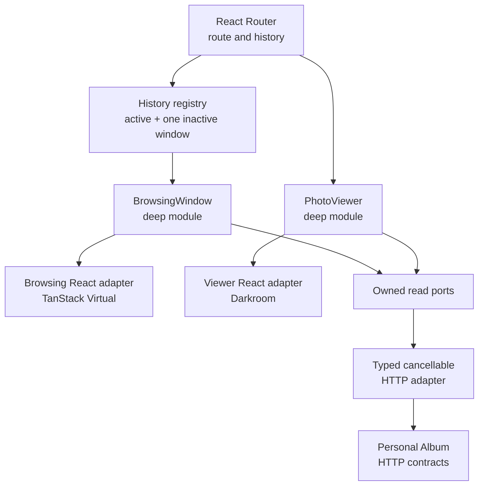

# Browsing Tracer Implementation

Status: Delivery Slices 1-5 implemented; Slice 6's functional Playwright coverage implemented (21 July 2026), its performance project deferred. Decisions confirmed 20 July 2026.

This plan implements section 3, **Browsing tracer**, of [Personal Light Table Design](./personal-light-table-design.md). It cuts the Web client from the legacy filtered grid to automatically loaded, month-grouped Timeline and read-only Archive browsing, with a private route-driven Photo Viewer and bounded 20,000-Photo behaviour.

It does not implement the plan. Implementation begins only after the design session is confirmed complete.

## Existing Foundation

The repository already provides:

- v2 Active and Archived projection reads with stable, collection-scoped cursors and a default page size of 80;
- year/month/Date Unknown counts through Album Navigation;
- `startAt` navigation anchors and stale-period conflicts;
- Small and Large Timeline Thumbnails with a batch access-renewal read;
- structured capture-local chronology and exact Date Index maintenance;
- private Photo detail and Display Access reads;
- CloudFront fallback to `index.html` for direct SPA routes.

The Web client still uses one legacy `UploadPage` containing manual Timeline filters, square thumbnails, an inline detail panel, upload selection, Upload Batch polling, and Retry behaviour. It does not automatically load browsing data or use a route library.

## Architecture

React Router owns URL matching, browser history, route cancellation, and the contextual versus direct Viewer route. It does not own cursor pages, layout, image access, or scroll restoration.

Each history entry's `BrowsingWindow` owns one continuous Active or Archived window beginning at the latest Photo or a date anchor and extending toward older Photos. `PhotoViewer` is independent so the same module works over a retained browsing route or as a directly loaded page.

## HTTP Contract Changes

### Collection reads

Continue using `GET /v2/timeline` and `GET /v2/archive`. Their response gains one additive thumbnail-access `expiresAt` value. Existing `photos`, `nextCursor`, and `anchorPeriod` semantics remain unchanged.

`POST /timeline-thumbnail-access` returns renewed responsive sources plus the same explicit access expiry. Renewal remains limited to 100 Photo IDs and signs only the current User's Ready Photos.

### Viewer bootstrap

Add one authenticated, `private, no-store` Viewer read for a Photo ID with an optional `active` or `archived` source collection. It returns:

- Viewer Photo fields and read-only Photo Metadata;
- active and Original Captured At data, source, and chronology revision;
- Archive membership;
- Display Access URL and expiry;
- resolved Viewer Sequence collection;
- nearest `newerPhotoId` and `olderPhotoId` when present.

With no source collection, the read infers the Photo's current collection. When a supplied collection no longer contains the Photo, it returns `409 photo_collection_changed`; the client never silently switches sequences.

The store derives the Photo's projection key from collection, active chronology, Added At, and Photo ID. Two strongly consistent `Limit: 1` queries find the nearest greater and lesser projection keys. A concurrent projection move is retried once and then returns a recoverable structured conflict. No neighbour links or new index are persisted.

### Typed errors and cancellation

HTTP error bodies expose stable codes separately from diagnostic messages. The Web transport distinguishes cancellation, network failure, non-JSON response, authentication loss, image failure, empty period, changed collection, and concurrent projection movement. Every read accepts an `AbortSignal`.

One protected-request `401` invalidates the Session, disposes all private controllers and access URLs, and then shows Sign-In. Session expiry keeps the intended URL for a completely fresh authenticated load; explicit Sign Out returns to `/`.

Legacy `/timeline`, Photo Detail, and Display Access reads remain during observation and rollback. Their removal is a later cleanup.

## BrowsingWindow Module

One deep module owns:

- collection and starting anchor;
- Album Navigation counts used by that window;
- cursor continuation and single-flight loading;
- first-seen Photo ID de-duplication;
- compact Photo descriptors and stable row layout;
- incomplete month row tails;
- Thumbnail Access leases and coalesced renewal;
- viewport demand, incremental failure, and end state;
- content restoration anchor and observed Sequence Position validity.

Its external interface consists of stable `getSnapshot()` and `subscribe()` functions, a small set of browsing intents, and `dispose()`. React consumes it through `useSyncExternalStore`. Production and tests supply HTTP and in-memory read adapters at an internal owned port.

The history registry retains the active window, including a Viewer-pinned origin, plus the most recently inactive window. Older history entries recreate from their URL anchor and do not promise an evicted deep scroll position.

External collection changes do not recompose the current window. The first accepted descriptor and position for a Photo ID win; later duplicate cursor results are ignored. Explicit mutations from the same client may patch the window. Re-entry or reload rebuilds from current projections.

## Justified Rows and Virtualisation

A pure layout module groups descriptors by known month or Date Unknown and composes each group independently into rows from container width, spacing, target height, and stored aspect ratio. Rows never crop Photos or cross period boundaries.

At a cursor boundary, the module withholds the small incomplete row tail. A later page may complete it without changing any visible row. The tail becomes a relaxed final row when the period is known complete, the collection ends, or incremental loading fails.

The React adapter uses `@tanstack/react-virtual` with window scrolling. Virtual items are month markers and completed rows with stable keys and precomputed sizes. Jump and restoration are instantaneous rather than smooth. Initial overscan is approximately four layout items and is tuned under the limit of 250 mounted Photo links/images.

The current window retains every compact descriptor it incrementally loads, up to the 20,000-Photo target. DOM, decoded images, request state, and temporary Thumbnail URLs remain bounded around the viewport. Distant URLs are discarded and renewed in batches as Photos approach the viewport.

## Loading and Image Access

After Session confirmation, the initial 80-Photo collection page and Album Navigation load in parallel. The controller requests one older page when completed layout is within roughly two viewport heights of the visible end, or earlier to complete a withheld row. Speculative loading pauses while hidden, offline, or inactive.

Collection and renewal responses expose a conservative access expiry. Visible or soon-visible Photos enter one coalesced renewal queue about 60 seconds before expiry. An image failure permits one immediate renewal and retry; a second failure leaves a local static placeholder.

Timeline images use actual-width `srcset` descriptors and a computed `sizes` value. Stored dimensions reserve geometry. The first visible row has higher fetch priority, other visible rows load eagerly, and overscan rows load lazily. A successful image performs one approximately 140ms decode fade, removed under reduced motion and never repeated after renewal.

The image has empty alt text inside a native Photo link. The link name combines Original File Name with only the Captured At components genuinely known.

## Date Navigation and History

Routes use a start-anchor query for `YYYY-MM` or `YYYY-unknown`. The query identifies the beginning of a Browsing Window, not a date filter and not the currently sticky period.

A manual Jump first loads a cancellable candidate window while leaving the current window visible. Success commits one URL/history entry. An empty-period conflict refreshes Album Navigation and leaves the current history untouched; other failures remain retryable in the navigation interaction.

Desktop year rows separate the year jump from their disclosure control. At most one year is expanded, and scroll changes active styling without changing disclosure. Expanded periods are newest first, followed by Date Unknown, with exact counts.

The mobile bottom sheet uses the same hierarchy. Selecting a year expands it, while `Latest in {year}` explicitly chooses its newest non-empty period.

Scroll restoration records the first substantially visible Photo ID and its row offset, or a period marker when it owns the top position. After responsive re-layout, the adapter finds the Photo's new row and recreates that relative offset. Absolute scroll position is only a same-layout fast path. Mutation fallback is remembered older neighbour, newer neighbour, then period marker.

## Photo Viewer

`PhotoViewer` owns the aggregate Viewer read, current Photo, a bounded Previous/current/Next window, Display Access expiry, prefetch cancellation, and scoped failures. It receives an optional source collection and a Viewer Sequence Position calculated by the originating Browsing Window.

Previous follows the visual collection order toward `newerPhotoId`; Next follows it toward `olderPhotoId`. Left arrow and swipe-right mean Previous, while right arrow and swipe-left mean Next. The sequence never loops.

After the current Display Photo decodes, the module may prefetch both adjacent Viewer responses and compressed image responses without mounting hidden decoded images. Data Saver, constrained network, background state, or stale navigation suppresses byte prefetch. Original Photo is never prefetched.

An exact-looking `n of total` is shown only when the live Date Index and contiguous Browsing Window provide a non-estimated result without an observed duplicate, gap, count contradiction, or mutation. It is not a snapshot guarantee and disappears when reliability is lost. Direct Viewer routes do not manufacture a position.

The tracer Viewer includes Fit display, Close, Previous, Next, known Captured At, conditional position, read-only Info, Escape and arrow keys, Darkroom presentation, and scoped loading or failure states. Swipe, zoom/pan, idle chrome, More actions, Archive/Restore, and Download Original remain later work.

### Contextual route

Opening from Timeline or Archive uses React Router contextual or masked navigation so the address is `/album/photos/{photoId}` while the origin remains mounted. The background becomes inert and hidden from the accessibility tree. Viewer owns a focus trap, initially focuses Close, and Close, Escape, or Browser Back returns focus without scrolling to the opening Photo link or its mutation fallback.

### Direct route

Loading or refreshing the Viewer URL creates only a standalone Darkroom page. The read infers current collection. Close navigates to that collection and focuses its main heading; it does not claim to restore absent browsing history. Native middle-click and new-tab behaviour therefore remains correct.

## Captured At Presentation

One pure formatter accepts structured Captured At and the UI locale. Compact, accessible, and detail presets serve month rails, thumbnail links, Viewer chrome, and Info. The formatter never parses an offset-free value as a browser-local or UTC instant, never invents missing precision, and shows Capture Time Offset only when present.

## Read-Only Archive Scope

The tracer applies the same Browsing Window, navigation, layout, and Viewer to Archive. Archive Photo, Restore Photo, Undo, and More actions remain in the supporting-workflows phase. This gives directly loaded Archived Viewer routes a complete Close destination without expanding tracer mutations.

## Verification

Vitest covers pure chronology presentation, Justified Rows, deep-module interfaces, cancellation, cursor de-duplication, tail completion, expiry renewal, neighbour state, and in-memory adapters.

Playwright uses generated intercepted cursor responses for real browser verification of:

- automatic initial load and incremental failure recovery;
- manual Jump commit and Back restoration;
- responsive re-layout around a content anchor;
- contextual and direct Viewer routes;
- focus isolation and restoration;
- Thumbnail and Display Access failure recovery;
- Session invalidation and private-state disposal;
- read-only Archive browsing;
- 320px WebKit functional smoke.

A pinned Chromium performance project uses a synthetic 20,000-Photo album with mixed and extreme aspect ratios, partial dates, and long file names. Acceptance requires:

- at most 75 MiB JavaScript heap growth over the signed-in empty baseline after all descriptors load;
- at most 250 mounted Photo links/images;
- one collection page request in flight and renewal batches no larger than 100;
- responsive re-layout plus anchor restoration p95 below 100ms under 4x CPU slowdown;
- no application long task above 50ms during continuous scripted scrolling;
- no geometry change in a row after it becomes visible.

Numeric budgets change only from recorded measurements on representative hardware.

## Delivery Slices

1. **Contracts and reads** — typed errors, expiry, Viewer bootstrap, neighbour queries, shared types, and store contract tests.
2. **Deep browsing core** — Browsing Window, Justified Rows, ports/adapters, leases, and restoration state.
3. **Route and migration seam** — React Router, registry, Session disposal, and temporary Manual Upload extraction.
4. **Timeline and Archive cutover** — automatic reads, virtual rows, date navigation, responsive images, and scoped errors.
5. **Photo Viewer tracer** — independent module, contextual/direct routes, bounded prefetch, Info, keyboard, and focus restoration.
6. **Acceptance hardening** — Playwright coverage, performance budgets, 320px WebKit, and production JPEG/PNG/HEIC smoke. Functional Playwright coverage and the 320px WebKit smoke are implemented (`apps/web/e2e/`), against intercepted HTTP responses; the pinned-Chromium 20,000-Photo performance project and its numeric budgets, and the production-format smoke, remain deferred pending a hardware/CI decision.

Each slice keeps workspace checks and tests green. Legacy read cleanup is explicitly outside this plan.

## Deferred Work

- Archive Photo, Restore Photo, and Undo;
- Upload Tray and its recovery boundary;
- Processing Issues UI;
- Original Download action;
- swipe, pinch zoom, pan, Fit/100%, and idle chrome transitions;
- removal of v1 browsing contracts and compatibility data.
