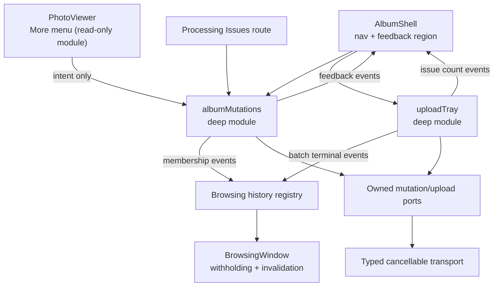

# Supporting Workflows Implementation

Status: Decisions confirmed 21 July 2026. Delivery Slices 1-3 implemented.

This plan implements section 4, **Supporting workflows**, of [Personal Light Table Design](./personal-light-table-design.md). It adds the four management flows that the browsing tracer deliberately left out: Archive Photo, Restore Photo and Undo; conditional Processing Issues navigation with a Retry lifecycle; single-action Original Download; and the Upload Tray that replaces the temporary Manual Upload workspace.

It is constrained by [ADR 0067](./adr/0067-withhold-photos-locally-for-membership-changes.md), [ADR 0068](./adr/0068-own-album-mutations-in-a-shell-level-module.md), and [ADR 0069](./adr/0069-recover-the-upload-tray-from-a-session-scoped-batch-id.md), and it must preserve the browsing constraints already accepted in ADR 0038, ADR 0039, ADR 0045, ADR 0055–0058, and ADR 0062.

All three Delivery Slices below are implemented.

`CONTEXT.md` requires no changes. Every decision here landed inside existing glossary terms — `Archive Photo`, `Restore Photo`, `Upload Tray`, `Processing Issue`, `Processing Issues`, `Retry Processing`, `Original Download`, and `Exact Duplicate` already say what was decided. Withholding, the recovery boundary, and the feedback region are implementation concepts and belong in the ADRs above.

## Existing Foundation

The backend already provides everything these flows read and write except three additive fields and one new read:

- idempotent Archive membership at `PUT`/`DELETE /photos/{photoId}/archive` (ADR 0038), maintaining v2 projections and the exact Date Index;
- durable Processing Issues at `GET /processing-issues`, cursor-paginated, with `photoId`, `fileName`, `reasonCode`, `status`, `addedAt`, `firstOpenedAt`, `attemptCount`, `lastAttemptAt` (ADR 0039);
- `POST /photos/{photoId}/retry-processing` with enqueue-before-marking and attempt identity (ADR 0040, ADR 0043);
- `POST /photos/{photoId}/original-download`, already presigning with `attachmentFileName: photo.fileName`;
- `POST /upload-batches` and `GET /upload-batches/{uploadBatchId}`, the latter returning `counts: Record<ProcessingState, number>` plus per-Photo status;
- `getProcessingIssuesSummary()` on the Personal Album store, returning the exact open count from a singleton summary item — currently reachable only from reconciliation.

The Web client provides the shell, both Browsing Windows, the Photo Viewer deep module with contextual and direct routes, the typed cancellable transport, centralised UI messages, and a Playwright suite in `apps/web/e2e/` with an `AlbumApiMock` fixture. It has **no** mutation surface, **no** feedback surface, **no** `More` menu, and **no** client-side persistence of any kind.

Two defects in the existing temporary upload path are in scope because the Tray inherits them:

- `createUploadBatch` issues `Promise.all` over every file — up to **100 simultaneous** XHR `PUT`s;
- `uploadToS3` has no retry, and upload presigns expire after `UPLOAD_URL_EXPIRES_IN_SECONDS` (default **900s**), all minted at batch creation.

## Architecture



Both new modules live **above the router**, created once per signed-in User alongside `browsingHistoryRegistry` in `AlbumRoot`, and disposed by the same Session-loss path (ADR 0062). `PhotoViewer` stays a read-only module and only *calls* mutation intents; it never owns their state.

## HTTP Contract Changes

### Processing Issues summary

Add `GET /processing-issues/summary`, authenticated, `private, no-store`, returning:

```ts
interface GetProcessingIssuesSummaryResponse {
  openCount: number;
}
```

It calls the existing `album.getProcessingIssuesSummary()`. It is a dedicated read rather than a field on `GET /session` — which would put a mutable counter on the authentication path with no way to refresh it — and rather than a field on Album Navigation, which is the Date Index and is invalidated by archiving.

### Upload Batch status

Extend `UploadBatchPhotoStatus` in `@album/shared` with three additive fields:

- `timelineAnchor?: string` — the `YYYY-MM` / `YYYY-unknown` navigation key, present for Ready Photos only. Derived server-side from the Photo's active chronology so the client never re-derives period grouping. This is what `View new photos` jumps to.
- `duplicateOfPhotoId?: string` — already recorded by `process-photo.ts` when an Exact Duplicate is identified, never previously exposed. Optional, because the matching Photo may since have been archived.
- `failureCode` narrowed from `string` to the shared reason union below.

`counts` needs no change: `ready` → *added*, `exactDuplicate` → *already in your album*, `processingFailed` → *needs attention*.

### Shared reason codes

Narrow `ProcessingIssue.reasonCode` and `UploadBatchPhotoStatus.failureCode` from bare `string` to one exported union covering the four codes actually written today — `finalProcessingFailure`, `metadataMismatch`, `unsupportedImage`, and `legacyProcessingFailure` (written by the backfill) — with the client tolerating an unrecognised code through one fallback message. Upload Tray and Processing Issues then share a single message map instead of two.

### Legacy route removal

Delete `POST /photos/{photoId}/archive`, `archivePhotoHandler`, `handleArchivePhoto`, and the now-unused `album.archivePhoto`. It is non-idempotent, does not maintain the v2 projections and Date Index that ADR 0028 and ADR 0030 depend on, has no caller in `apiClient`, and becomes genuinely dangerous the moment archiving is a real User action. Remove its CDK route and Lambda in the same change.

## Mutation Foundations

### `albumMutations`

New deep module at `apps/web/src/features/album/albumMutations.ts`, with an owned port (`albumMutationsPort.ts`) plus HTTP and in-memory adapters, following the shape of `albumBrowsingPort` and `photoViewerPort`.

It owns Archive Photo, Restore Photo, Retry Processing, and Original Download; the optimistic apply and its rollback; and the events the shell and registry subscribe to. Its external interface is `getSnapshot()`, `subscribe()`, intents, and `dispose()`.

Membership intents take `{ photoId, collection }` and run in this order:

1. instruct the registry to apply the membership change (below);
2. publish the feedback entry with its Undo action;
3. issue `PUT`/`DELETE /photos/{photoId}/archive`;
4. on success, refetch Album Navigation eagerly so the month rail and year index stay truthful;
5. on failure, reverse step 1 and replace the feedback entry with a persistent, retryable failure naming the Photo. **Do not reverse any navigation.**

Because membership is idempotent desired-state (ADR 0038), a Photo already archived elsewhere returns success and needs no conflict UI — unlike Captured At, which carries optimistic concurrency for exactly the opposite reason (ADR 0037).

### Membership application (ADR 0067)

Extend `BrowsingWindowIntents` with a withholding intent that marks a loaded descriptor as not present, and `justifiedRows` to skip withheld descriptors when composing rows. The descriptor is never removed, so reversal restores the identical index and no visible row changes geometry.

The registry applies one rule on every membership change:

> Any **mounted** window whose collection the Photo just left withholds it. Every collection **not currently mounted** is invalidated.

This is symmetric across Archive and Restore, covers a direct-route Viewer with no mounted window (both collections invalidated), and covers Photos arriving from Upload Batch processing — which invalidate the non-mounted windows and deliberately leave the mounted Timeline alone, satisfying "the current Timeline does not reflow or jump unexpectedly."

The Date Index is marked stale and eagerly refetched, never decremented locally. `Viewer Sequence Position` may briefly disappear, which the design already permits.

### Feedback region

One region rendered by `AlbumShell`, above the Viewer modal layer, `aria-live="polite"`, holding a **single** entry that the newest replaces.

- Success entries auto-dismiss after **8 seconds** and may carry one action. Eight rather than the customary five because Mobile Browsing is the quality baseline and reaching a 44px `Undo` target takes longer than a mouse does.
- Failure entries persist until dismissed or retried.
- Entries are bound to **time, not route** — Undo is only a `photoId` plus a Restore call, so it stays valid after navigating to Archive.
- Session loss disposes the region with the rest of private client state; no toast survives over Sign-In.

Content errors stay where they already are. This region is for outcomes whose originating scope no longer exists by the time they resolve.

## Photo Viewer More

Add a `More` menu to `PhotoViewerDarkroom` containing exactly two items, by collection:

| Collection | Items |
| --- | --- |
| Timeline | `Archive photo`, `Download original` |
| Archive | `Restore to timeline`, `Download original` |

The menu is keyboard operable with visible focus; `Escape` closes the menu before it closes the Viewer. `PhotoViewer` gains no mutation state — the adapter calls `albumMutations` intents directly.

On Archive or Restore, the Viewer advances toward `olderPhotoId`. When there is none, it advances toward `newerPhotoId`. When there is neither, the Viewer closes and returns to the originating collection, which then renders its empty state.

### Original Download

`Download original` requests `POST /photos/{photoId}/original-download` and starts the transfer with `window.location.assign(url)`. The response already carries `Content-Disposition: attachment` with the Original File Name, so the page does not navigate away.

`window.open` is wrong here: the URL arrives after an `await`, and iOS Safari blocks a window opened outside the original user gesture. An `<a download>` is also wrong: the `download` attribute is ignored cross-origin, so it would work in development and silently degrade in production.

While the presign request is in flight the menu item shows `Preparing download…`; failure goes to the feedback region as a persistent error naming the file. Add an API test asserting the attachment disposition — the client now depends on it to avoid navigating the User out of the album into a raw JPEG.

`Adjust date and time` is **not** added to this menu. It relocates a Photo to another calendar period, which ADR 0067's model cannot express; it needs its own slice.

## Processing Issues

New route `/album/processing-issues`, rendering a durable, cursor-paginated list from `GET /processing-issues`.

Each row shows Original File Name, Added At, a User-comprehensible reason mapped from the narrowed reason union, and `Retry Processing`. Retrying leaves the issue open and moves it to `retrying`. The view never exposes queues, processors, storage services, hashes, or infrastructure terminology, and never surfaces a raw reason code.

Resolution outcomes:

- the Photo becomes Ready → the row offers `View in timeline`;
- retry identifies an Exact Duplicate → the row reports `Already in your album` and offers to open the matching Ready Photo when one is identified;
- when the last issue resolves, the view shows a completion empty state.

### Navigation count

The conditional nav entry is **client-held and event-driven**, not a live server mirror. It is seeded once from `GET /processing-issues/summary` when the album loads, then updated from events the client already owns: an Upload Batch reaching terminal state, a Retry resolving, and the Processing Issues view loading.

It deliberately does **not** disappear while the User is standing on the view. The design says the destination disappears "after leaving it" — a count-polled entry would remove the destination from under the User the instant their last retry succeeded.

### Polling

Polling is confined to one case: the Processing Issues view is open, at least one issue is `retrying`, and the document is visible. It reuses the 2s cadence already in the temporary workspace and pauses when hidden, consistent with the Timeline pausing speculative loading while hidden.

## Upload Tray

New deep module at `apps/web/src/features/upload/uploadTray.ts` with an owned port, created above the router and rendered by `AlbumShell`. It survives route changes and Photo Viewer, and can minimise to a persistent progress bar; on mobile it is a bottom sheet that collapses to the same bar.

`fileValidation.ts`, `hashFile.ts`, `uploadState.ts`, and `uploadToS3.ts` are retained and reused. `ManualUploadWorkspace.tsx` and its test are deleted.

### Selection

Desktop drag-and-drop plus an explicit file picker; mobile system photo/file selection; file name, size, and validation result; removal of individual selections; no manual reorder. The existing 100-file Upload Batch boundary is unchanged.

Local previews use `URL.createObjectURL(file)` in an `` with reserved geometry, `loading="lazy"`, and `decoding="async"`, revoked on removal and on unmount. This satisfies "without decoding every full-size source simultaneously" by viewport-gating rather than by worker or canvas downscaling — the same lever the Timeline already pulls.

HEIC/HEIF falls back to a clear format tile **on the `` `error` event**, not by sniffing extension or MIME type. The design says a format tile is for when a preview *cannot* be produced; Safari can decode HEIC, and extension-sniffing would deny a real preview to the browser most likely to receive HEIC files.

### Transfer

Replace the unbounded `Promise.all` with a bounded queue of **4** concurrent transfers. Unbounded parallel `PUT`s on a phone is the most likely way a 100-file batch fails today, and it also makes per-file progress meaningless.

`uploadToS3` gains **2** retries with exponential backoff, for network-class failures only (`onerror`, timeout) and never for an HTTP 4xx.

An expired presign — possible on a large batch over a slow uplink, since all 100 URLs are minted at batch creation with a 900s lifetime — surfaces as a distinct per-file failure, `Selection expired — add these again`. A re-presign endpoint is a known, self-contained future addition; it is deliberately not built here.

`beforeunload` is registered only while at least one file is actively transferring and removed as soon as transfers finish, even though server processing continues — the design scopes the warning to transfer, and warning during processing would contradict "the User may keep browsing."

File rows distinguish browser transfer from server processing throughout.

### Recovery (ADR 0069)

`sessionStorage`, keyed by User ID, holding only `{ uploadBatchId, startedAt }`. On album load, if `startedAt` is within ~30 minutes, fetch `GET /upload-batches/{uploadBatchId}`; show the Tray only if at least one Photo is still `uploadRequested` or `processing`. Otherwise clear the key silently. Cleared on Sign Out and on Session loss.

### Completion

```text
12 added
2 already in your album
1 needs attention
```

Derived from `counts`. Exact Duplicate is neutral, not an error, and links to the matching Ready Photo when `duplicateOfPhotoId` is present. `needs attention` links to Processing Issues. Processing Failed alone contributes to it.

When the batch reaches terminal state with at least one Ready Photo, the Tray offers `View new photos`, which performs a **Date Jump to the period of the newest-Captured-At new Ready Photo** using its `timelineAnchor`, through the existing probe-then-commit path (ADR 0058, ADR 0041). Reloading the Timeline from the top would be wrong: uploads are frequently *old* Photos, and "newest" would show the User nothing they just added. When the new Photos are the newest, this degenerates to the top for free.

## Routing Changes

- `Add photos` becomes a `<button>` opening the Tray, in both `AlbumShell` and the empty state in `App.tsx`. It does **not** auto-trigger the OS file picker — that costs desktop users the drag-and-drop affordance and an unrequested system dialog is startling.
- The Tray has **no URL**. Giving it a route would resurrect the "permanent upload page" the design rejects.
- `/album/upload` is deleted, and `AlbumRoutes` gains a catch-all redirecting unknown `/album/*` paths to `/album`, which it currently lacks at that level.
- `/album/processing-issues` is added.

## Verification

Vitest, port-injected, in the style of `browsingWindow.test.ts` and `photoViewer.test.ts`:

- `albumMutations`: optimistic apply, success, failure rollback of membership but not navigation, idempotent re-archive, Session-loss disposal;
- withholding: reversal restores the identical index, no row geometry change, withheld descriptors excluded from layout;
- registry rule: mounted window withholds, non-mounted collections invalidated, direct-route case;
- feedback region: 8s expiry, single-slot replacement, failure persistence, route independence;
- `uploadTray`: bounded concurrency, retry classification, recovery gating on non-terminal Photos and on the freshness window, completion counts;
- reason-code mapping including the unknown fallback.

API tests: the summary endpoint; `timelineAnchor` and `duplicateOfPhotoId` on batch status; the `Content-Disposition` assertion; removal of the legacy archive route.

Playwright, extending `apps/web/e2e/` and its existing `AlbumApiMock` — the suite is already installed and covers nine scenarios, so **do not re-scaffold it**:

- archive from the contextual Viewer, Timeline updates without reflow, Viewer advances;
- Undo restores to the identical position;
- archive failure returns the Photo and shows a persistent error without moving the Viewer;
- Undo after navigating to Archive;
- Processing Issues appears, retries, resolves, and persists in nav until the User leaves;
- Upload Tray survives a route change and a Photo Viewer open;
- Tray recovery after reload with processing still underway;
- `View new photos` jumps to an older period.

## Delivery Slices

1. **Mutation foundations, Archive/Restore/Undo, Original Download** — `albumMutations` and its port; the feedback region; the withholding intent and registry rule; eager Date Index refetch; Viewer `More`; download via `location.assign`; deletion of the legacy `POST` archive route.
2. **Processing Issues** — summary endpoint and shared type; narrowed reason union and shared message map; `/album/processing-issues`; event-driven conditional nav count; Retry lifecycle and scoped polling; completion empty state.
3. **Upload Tray** — the three contract additions; `uploadTray` with `sessionStorage` recovery; bounded queue, retry, and `beforeunload`; previews with `error`-based HEIC fallback; completion summary with duplicate link; `View new photos`; routing cutover and deletion of `ManualUploadWorkspace`.

Each slice keeps workspace checks and tests green.

## Deferred Work

- `Adjust date and time` and `Revert Captured At` in the UI — needs a window-relocation design that ADR 0067 deliberately does not provide;
- a re-presign endpoint for long Upload Batches;
- swipe, pinch zoom, pan, Fit/100%, and idle chrome transitions (section 5);
- the pinned-Chromium 20,000-Photo performance project still outstanding from section 3;
- production JPEG/PNG/HEIC format smoke;
- permanent deletion, which the design excludes and which would require its own retention policy.
